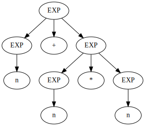
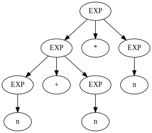

# Earley parser

This is an implementation of an [earley parser](https://en.wikipedia.org/wiki/Earley_parser) written in Rust.

The parser first reads the grammar specification from a string.
Take, for example:
```
EXP
EXP -> EXP + EXP
EXP -> EXP * EXP
EXP -> EXP - EXP
EXP -> EXP / EXP
EXP -> ( EXP ) 
EXP -> n
```
Then it will parse any given input and will return a list of parse trees.

For example, given ```n+n*n``` the parser will output the following trees:




Our method of constructing the parse trees is simple but slow. We effectively embed all
the derivation trees in the construction of the Earley sets. 

The paper [SPPF-Style Parsing From Earley Recognisers](https://www.sciencedirect.com/science/article/pii/S1571066108001497) describes
this method as a fix to the [original](https://web.archive.org/web/20040708052627/http://www-2.cs.cmu.edu/afs/cs.cmu.edu/project/cmt-55/lti/Courses/711/Class-notes/p94-earley.pdf)
method of constructing the parse trees (which is incorrect).

It is shown that this method does not result in a cubic parser, so I would advise you to search for a better solution if speed is what you want.

## Limitations
- As mentioned above, this parser is slow
- It does not support cyclic grammars (which are bogus anyway). It will forever loop in the scan/predict/complete cycle because there is an infinite set of parse trees.
